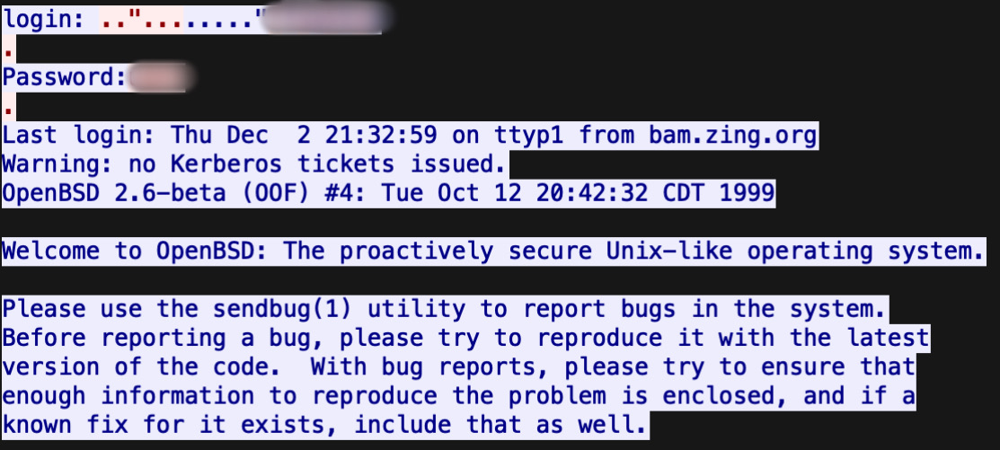
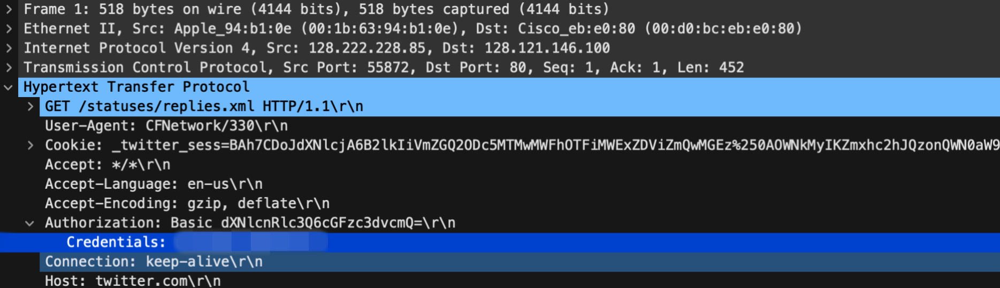

FTP Authentification

Examine the ch1.pacp file with Wireshark to get the answers

TELNET AUthentification

TWITTER Authentification

ETHERNET FRAME 

- Open the ch3(1) in a new tab and copy the hexadecimal code
- Convert it to to ASCII at https://www.rapidtables.com/convert/number/hex-to-ascii.html
- Convert the output at https://www.base64decode.org/