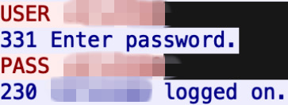

FTP Authentification

Examine the ch1.pacp file with Wireshark to get the answers

TELNET AUthentification

Examine the ch2.pacp file with Wireshark and follow the TELNET stream

TWITTER Authentification

Examine the ch3.pacp file with Wireshark and follow the TWITTER stream

ETHERNET FRAME 

- Open the ch3(1) in a new tab and copy the hexadecimal code
- Convert it to to ASCII at https://www.rapidtables.com/convert/number/hex-to-ascii.html
- Convert the output at https://www.base64decode.org/
